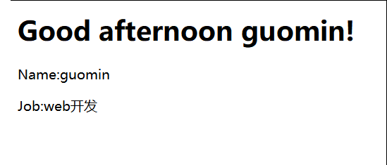
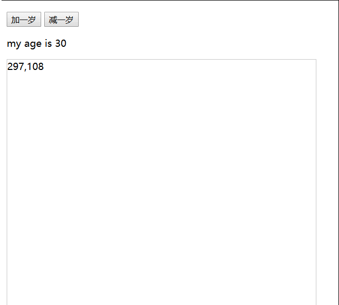
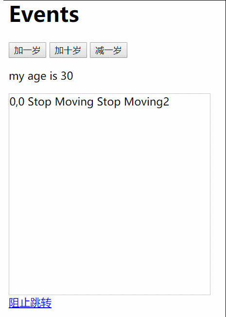
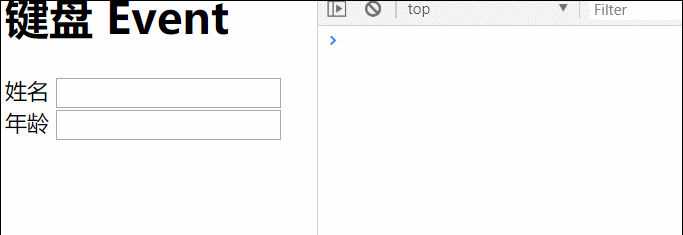
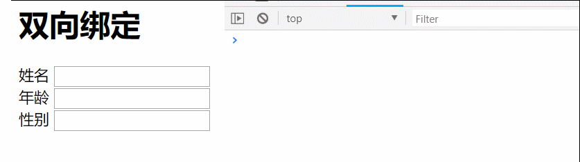
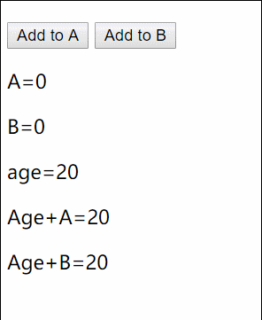
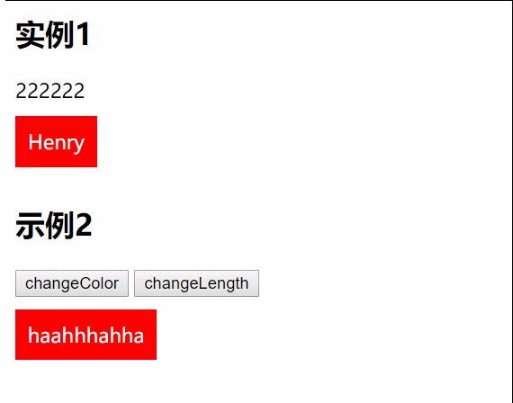
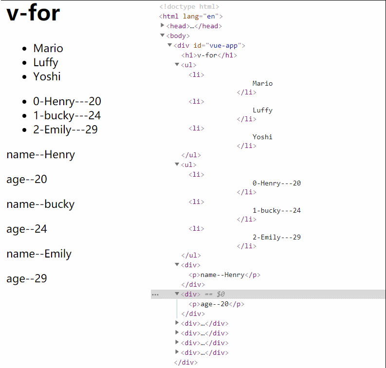
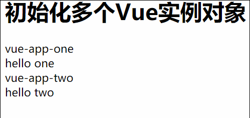
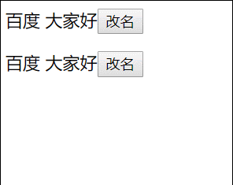

#Vue.js

## vue框架 ##
html

	<body>
	    

	        <h1>{{name}}</h1>
	    

	</body>

js

	//实例化对象
	new Vue({
	    el:"#vue-app",
	    data:{
	        name:"guomin"
	    }
	});

## vue中方法 ##

html

	<body>
	    

	        <h1>{{greet('afternoon')}}</h1>
	        
Name:{{name}}

	        
Job:{{job}}

	    

	</body>

js  

	//实例化对象
	new Vue({
	    el:"#vue-app",
	    data:{
	        name:"guomin",
	        job:"web开发"
	    },
	    methods:{
	        greet:function (time) {
	            return 'Good '+time+' '+this.name+'!';
	        }
	    }
	});

- el:element 需要获取的元素，一定是html中的根容器元素

- data:用于数据的存储

- methods: 指定方法

## vue中属性绑定 ##

html 

	<body>
	    

	        <h1>{{greet('afternoon')}}</h1>
	        
Name:{{name}}

	        
Job:{{job}}

	        <a v-bind:href="website">web开发</a> 
	        <input type="text" v-bind:value="name">
	        

	    

	    
	</body>

app.js

	//实例化对象
	new Vue({
	    el:"#vue-app",
	    data:{
	        name:"guomin",
	        job:"web开发",
	        website:"http://www.baidu.com",
	        websiteTag:"<a href='http://www.baidu.com'>百度</a>"
	    },
	    methods:{
	        greet:function (time) {
	            return 'Good '+time+' '+this.name+'!';
	        }
	    }
	});

- data-binding:给属性绑定对应的值

	<a v-bind:href="website">web开发</a> 

给a标签绑定一个href属性，值为Vue实例中的website

	<input type="text" v-bind:value="name">

给input绑定value属性，值为vue实例中的name

	 

给p标签绑定一个html属性，内容为vue实例中的websiteTag值。

## vue中的事件 ##

html

	<body>
	    

	        <h1>Events</h1>
	        <button @click="add(1)">加一岁</button>
	        <button v-on:click="substract(1)">减一岁</button>
	        
my age is {{age}}

	        

	            {{x}},{{y}}
	        

	    

	</body>

js

	

## vue中的事件修饰符  ##

html

	

	        <h1>Events</h1>
	        <button @click="add(1)">加一岁</button>
	        <button @click.once="add(10)">加十岁</button>
	        <button v-on:click="substract(5)">减一岁</button>
	        
my age is {{age}}

	        

	            {{x}},{{y}} Stop Moving 
	            Stop Moving2 
	        

	        <a v-on:click.prevent="hello" href="http://www.baidu.com">阻止跳转</a>
	    

	</body>

js  

	

- @click.once="add(10)" 只执行一次

- v-on:mousemove="updateXY"绑定事件

- @click="substract(5)"等同于v-on:click="substract(5)"

- v-on:click.prevent="hello" 点击阻止默认行为

## 键盘事件和键值修饰符 ##

html 

	<body>
	    

	        <h1>键盘 Event</h1>
	        <label>姓名：</label>
	        <input type="text" v-on:keyup.enter="logName">
	        <label for="">年龄</label>
	        <input type="text" v-on:keyup.enter="logAge">
	    

	</body>

js

	

## 双向绑定 input/select/textarea ##

html

	<body>
	    

	        <h1>双向绑定 input/select/textarea</h1>
	        <label>姓名：</label>
	        <input ref="name" type="text" v-on:keyup="logName">
	        {{name}}
	        <label for="">年龄</label>
	        <input ref="age" type="text" v-on:keyup="logAge">
	        {{age}}
	        <label for="">性别</label>
	        <input ref="sex" type="text" v-model="sex">
	        {{sex}}
	    

	</body>

js

	

绑定方法 

ref属性，通过v-on方法，在方法中通过下面方式实现双向绑定

	this.name=this.$refs.name.value;

也可以通过v-model来绑定

	<input ref="sex" type="text" v-model="sex">
    {{sex}}

## vue的计算属性  ##
html

	<body>
	    

	        <h1>computed 计算属性</h1>
	        <button v-on:click="a++"> Add to A</button>
	        <button v-on:click="b++">Add to B</button>
	        
 A={{a}}

	        
B={{b}}

	        
age={{age}}

	        
Age+A={{addToA}}

	        
Age+B={{addToB}}

	    

	</body>
	
js

	

## vue动态绑定css ##

	<body>
	    

	        <h1>动态css</h1>
	        <h2>实例1</h2>
	        
222222

	        Henry
	        <h2>示例2</h2>
	        <button v-on:click="changeColor=!changeColor">changeColor</button>
	        <button v-on:click="changeLength=!changeLength">changeLength</button>
	        

	            haahhhahha
	        

	    

	</body>

js

	

css 

	span{
	    background: red;
	    display: inline-block;
	    padding:10px;
	    color: #fff;
	    margin: 10px 0;
	}
	.changeColor span{
	    background: green;
	}
	.changeLength span:after{
	    content: 'length';
	    margin-left: 10px;
	}

## vue  for循环 ##

html

	<body>
	    

	        <h1>v-for</h1>
	        <!--数组遍历-->
	        <ul>
	            <li v-for="item in characters">
	                {{item}}
	            </li>
	        </ul>
	        <ul>
	            <li v-for="(item,index) in users">
	                {{index}}-{{item.name}}---{{item.age}}
	            </li>
	        </ul>
	        <template v-for="(user,index) in users">
	            

	                
{{key}}--{{val}}

	            

	        </template>
	    

	</body>

js

	

## 初始化vue多个对象 ##

html

	<body>
	    <h1>初始化多个Vue实例对象</h1>
	    

	        {{title}}
	        {{greet}}
	    

	    

	        {{title}}
	        {{greet}}
	    

	</body>

js

	

## 组件 ##

html

	<body>
	    

	        <greeting></greeting>
	    

	    

	        <greeting></greeting>
	    

	</body>

js

	

